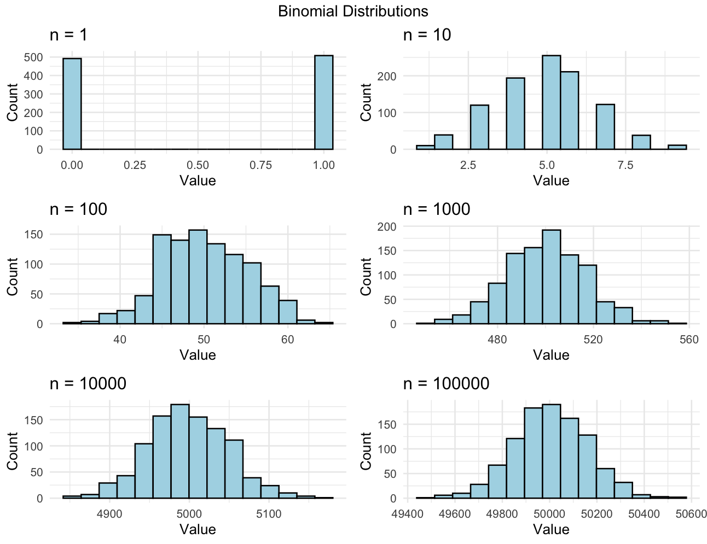

# Binomial Distirbution Convergence to Normal in the Large *N* Limit

## Theory

The proof presented here demonstrates that for a binomial probability distribution function, *B(n,p)*, where n is the number of trials and p is the probability of success, that as n increases towards infinity, the distribution converges towards a normal probability distribution. The goal of this presentation is to test this theory using random number generators and data visualization.

## Method

For this presentation, R and packages (tidyverse, ggplot2, gridExtra) will be utilized. To test the theory, the *n* parameter will be gradually increased, while maintaining a consistent *p* parameter, to demonstrate the convergence to normal.

## Test

As mentioned in the method section, the primary test will be visualizing binomial distributions of increasing *n*.

See below for the binomial distributions created in Python:

# binomial distributions, with increasing n

See below for an example binomial distribution, with n = 1, and p = 0.5

`binomial1 <- data_frame(` \
`  values = rbinom(1000,1,0.5)` \
`)`

Six other binomial variables were created, following `rbinom(size,n,o)` are created, with consistent *p* and *size* and varying *n*.

See below for each of the distributions plotted into histograms:

As can be seen in the figure above, as we increase n, the distributions begin to converge into a normal distribution pattern, where *n = 1* being an extreme with no normal pattern, and *n = 100,000* having a very normal distribution pattern.

