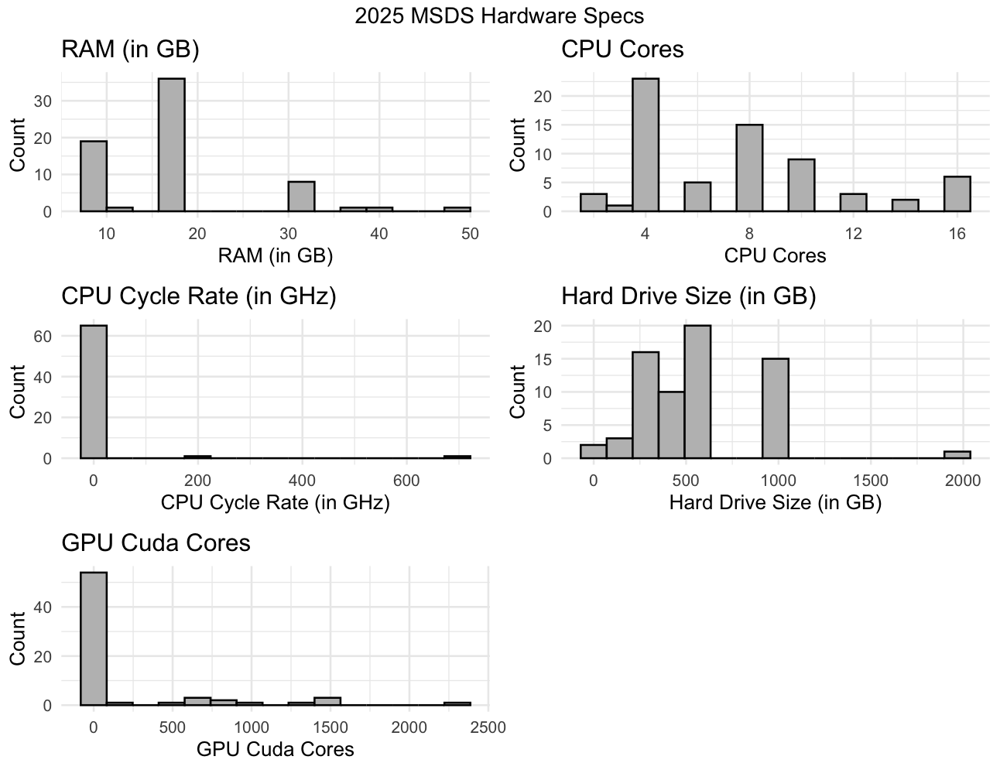

# UVA MSDS Computer Hardware Survey Exploratory Data Analysis

## Overview

As part of the technical orientation for UVA's MSDS program, students input their computer's specs into a survey, and the results are compiled into a dataset to be used for analysis. The following presentation will provide histograms and other analysis.

## Method

For this presentation, R and packages (tidyverse, ggplot2, gridExtra) will be utilized.

For data preparation, the `timestamp` column was converted into a datetime field, and then the dataframe was filtered to after survey date for the 2025 cohort, which was June 13th, 2024.

## Results

See below for the distribution of computer specs plotted into histograms for the 2025 cohort:

